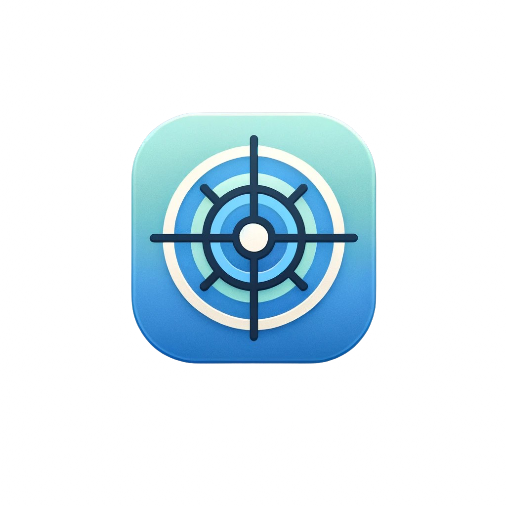

# LatenSee

<p align="center">
  
</p>

<p align="center">
  Improve first-run latency and visualize the latency of server-less function invocations.
</p>

|   |   |    |
|   |   |   |

   
  

---
### Features

LatenSee is a light application which will consistently ping your Lambda functions keeping them warm, and thus providing a faster client experience for your end-users. Point LatenSee to your functions, select an invocation rate and LatenSee will take care of the rest!

**Performance at a glance**

See all your function's latency from recent invocations and stats about your app's Lambdas

**Warm any lambdas**

Easily add new endpoints to LatenSee and instantly start keeping them warm

**Granular Control**

Organize Lambdas into different apps and control invocations uniquely for each function.

---
### How to use LatenSee

#### Update your Lambda functions to recognize LatenSee's pings:

In your Lambda functions, add these two lines surrounding function's declaration:

```diff
+ let cold=true;
export const handler = async (event) => {
+   if(event.body==='LatenSee'){const body={cold};cold=false;return{statusCode:200,body:JSON.stringify(body)};}cold=false;

  /**
   * Retain all other Lambda Functionality here
   */
  return { statusCode: 200, body: JSON.stringify('Lambda complete') };
};
```

See below for an explanation of the snippet:

```JavaScript
// Declare varible to flag when this is a cold start
let cold = true;

export const handler = async (event) => {
  // If the request is coming from LatenSee, then process it first
  if (event.body === 'LatenSee') {
    // Save status of cold when function runs
    const body = { cold };
    // Set cold to false since we have now run it
    cold = false;
    // return with the cold status
    return { statusCode: 200, body: JSON.stringify(body) };
  }
  // for all other functionality, set cold to false since we have warmed this function
  cold = false;

  /**
   * Retain all other Lambda Functionality here
   */
  return { statusCode: 200, body: JSON.stringify('Lambda complete') };
};
```
#### Build LatenSee locally and then create a docker image

```Bash
npm run build
docker build -t latensee-image .
```

#### Deploy your docker image alongside your production lambdas

For a sample guide, you can follow our high-level proof of concept walkthrough [here](/DeployOnECS.md).

---
### Contributors

| **Stephen Chow**  |  [](https://www.linkedin.com/in/stephen-chow-75b2a325/) |  [](https://github.com/stc415) |
| **Reem Abi Ammar**  | [](https://www.linkedin.com/in/reem-abi-ammar-09305b62/)   | [](https://github.com/RGA29)  |
| **Emma Ijiogbe**  | [](http://linkedin.com/in/eijiogbe)   | [](https://github.com/emmagawd)  |
| **Evan Griffith**  | [](https://www.linkedin.com/in/evancgriffith/)   |  [](https://github.com/EvanCG) |

**Stephen Chow**

[](https://www.linkedin.com/in/stephen-chow-75b2a325/) [](https://github.com/stc415)

**Reem Abi Ammar**

[](https://www.linkedin.com/in/reem-abi-ammar-09305b62/) [](https://github.com/RGA29)

**Emma Ijiogbe**

[](http://linkedin.com/in/eijiogbe) [](https://github.com/emmagawd)

**Evan Griffith**

[](https://www.linkedin.com/in/evancgriffith/) [](https://github.com/EvanCG)


If you found this interesting or helpful, feel free to drop a star on this project!

You can contribute by:
- Raising issues you find in [GitHub Issues](https://github.com/oslabs-beta/LatenSee/issues)
- Fixing issues by opening pull requests
- Improving documentation

In order to run the test suite, you can use the following:

```bash
npm install
npm run test
```
---
### License

LatenSee is distributed under the MIT License.